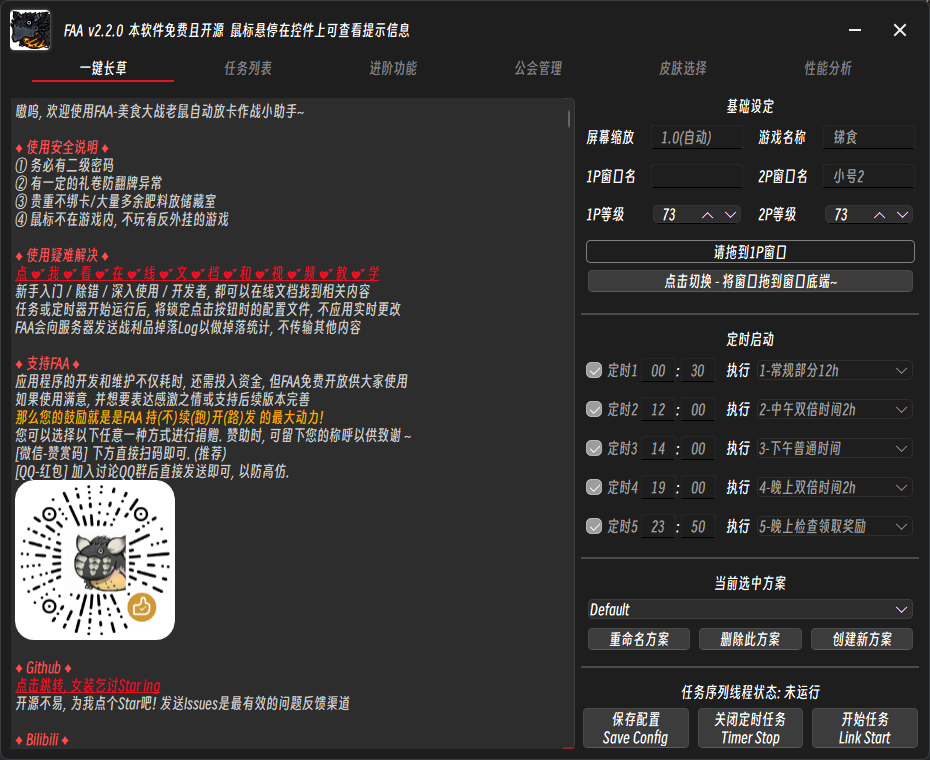

# FAA美食自动助理 FoodsVsMouses_AutoAssistant

《美食大战老鼠》的自动助手，一键完成所有日常。  

软件基于图像识别 + 自动放置卡片完成战斗，不支持任何作弊功能（如秒杀）。  

本软件历经两年开发，趋近成熟，功能完善且丰富。  

该工具开发初衷是圆梦十年前的童年愿望 (悲)    

# 主页 | Home

[FAA - 网络文档](https://stareabyss.github.io/FAA-WebSite/)  包括了功能综述, 新手入门教程, 进阶介绍, 开发文档.

备案可能过期! 请坚持访问! 网站也是开源的没有脏东西请放心使用!

文档主体搬迁至该网站, 并逐步施工中... 此页面部分重复内容不再保留.

# 支持开发 | Buy Me a Coffee

### 点Star - 觉得本项目有帮助请右上点一下Satr吧, 谢谢

### B站充电 - 你知道吗! B站大会员每月白嫖5B币券, 用于给UP充电!
* [点我领劵](https://account.bilibili.com/account/big/myPackage)
* [点我充电](https://space.bilibili.com/34158086)

### 微信赞赏码 - 请扫码下图 - 0抽成!

爱发电因备案过期暂时无法访问! 暂时终止使用!

# 下载 | Download 

## 关于版本
* 请注意, FAA分为不稳定的beta版本和稳定版. 
  * 标记为beta的测试版本包含大量潜在bug, 切勿用于日常大量使用.
* 关于版本号: a.b.c (例如: 2.1.2)
  * a主版本号: 务必使用最高最新的大版本 
  * b是功能版本号：务必使用最高或次高的小版本
  * c是bug修复版本号：同样的ab的版本中, 修订越少的版本会存在更多问题, 甚至导致无法运行. 大量版本一般越稳定.

## Github-Release  
* 点击上方按钮跳转. 找到最新的版本, 找到最新的版本, 下滑过更新介绍, 找到下方的.zip文件, 解压后开袋即食.
* 此项目的源码会实时更新, 但打包版会滞后.

## 交流QQ群-群文件
* 包含FAA的稳定发行版和内部测试版(beta).
* 更有玩家社区维护的大量战斗方案供您使用.
*  1800/2000人 推荐加入
*  1800/2000人 推荐加入

# 预览 | Preview

## 运行主页  

## 流程配置  

## 高级选项  

## 战斗方案编辑器  

# 功能 | Feature

### 自动日常 - 非战斗类流程
* 日常打卡
  * VIP签到 & 每日签到
  * 美食活动 & 寻宝塔罗 & 法老宝藏 - 每日免费许愿
  * 公会日常 - 花园浇水 / 施肥 / 摘果, 会长发布公会任务
* 自动领取奖励, 包括: 普通任务 / 公会任务 / 情侣任务 / 悬赏任务 / 美食大赛 / 大富翁 / 营地任务...
* 自动使用消耗品, 可自定义删除对象
* 二级密码功能
  * 自动删除无用道具, 可自定义删除对象
  * 公会副本商店 - 兑换暗晶.

### 流水线刷图 - 战斗类流程
* 常规刷本
  * 轻松打完几乎所有副本. 支持下列所有副本的自动进出! 并内置战斗方案.
  * 所有常规地图
  * 所有番外关卡
  * 所有特殊关卡, 具体如下:
    * 勇士副本 
    * 火山遗迹 
    * 跨服副本 
    * 魔塔蛋糕所有模式
    * 宠物关卡
    * 悬赏关卡
    * 公会副本 
    * 假期副本 
    * 世界BOSS
* 自动任务 
  * 公会任务, 情侣任务. 
    * 基于图像识别, 智能处理任务要求.
  * 美食大赛(战令任务)
    * 基于特制OCR和语义识别, 超强执行力, 确保完成.
* 自定义任务序列
  * 接口开放, 可完全自定义的任务列表. 支持更多参数和自定义顺序.
  * 支持使用任务序列可视化编辑器进行编写.
* 支持无限跨服副本刷威望

### 自动放卡战斗
* 模仿人类思考方式的算法实现, 从目标阵容和卡片与位置重要性角度进行合理放卡.
* 单人双人均可支持.
* 方案系统
  * 下限低, 大量内置方案, 轻松上手入门.
  * 上限高, 攻略各种高难副本, 魔塔165 / 音乐节夜 / 悬浮梦境 均不在话下.
  * 可分享的单文件配置系统, 便于分享抄作业.
  * 内置可视化编辑器, 轻松编辑, 无需代码.
* 超强自动化
  * 自动承载卡
    * 仅需将对应卡片放入卡组中, 无需在战斗方案进行额外设置, 即可根据关卡自适应放置.
    * 支持从米苏物流获取最新关卡信息, 无需软件更新.
  * 自动极寒冰沙, 仅需将对应卡片放入卡组中, 无需在战斗方案进行额外设置, 即可根据战况自适应放置.
  * 自动幻幻鸡 / 创造神, 仅需将对应卡片放入卡组中, 仅需在战斗方案设置各卡片被复制的优先级, 即可根据战况, 自适应放置完成复制.
  * 自动武器技能.
  * 鼠标模拟拾取.
  * 支持定时器放卡, 处理特定机制.

### 开发者模式
* **高级战斗模块**(beta)
  * 基于深度学习的图像识别 + 线性规划.
  * 实现自动使用对策牌, 解决高危目标和场地机制. 
* **脚本扩展接口**(beta)
  * 使用 FAA 图色和键鼠接口, 完成一切自动化任何功能! 
  * Json格式, 便于分享和保存.
  * 允许使用拓展插件, 可视化进行 自定义脚本 的编辑.

### 其他特性
* 无限跨服一分钟刷威望.
* 自动定时启动, 真正做到设置一次, 点击一下, 自动刷一周!
* 公会管理器! 自动扫描每周贡献值!
* 战利品和开宝箱记录
  * 精准图像识别, 自动纠错, 保存历史记录.
  * 上传至[美食数据站 - FAA米苏物流](https://faa.msdzls.cn/)统计副本掉率.
* 联动天知强卡器! 允许将其作为一个FAA事项启动.

# 免责声明 | Disclaimer

* 本软件使用 [AGPL 3.0 协议](https://github.com/StareAbyss/FoodsVsMiceAutoAssistant/blob/main/LICENSE)开源.
  * 免费, 仅供学习交流使用. 
  * 若您遇到商家使用本软件进行代练并收费, 可能是设备与时间等费用, 产生的问题及后果与本软件无关.
* 请 **不要使用低版本** 的FAA进行游戏 , 初次执行过程中建议 **<关注执行情况>** 
* 若执行中因bug导致任何问题, 请立刻 **<刷新游戏窗口>** + **<叉掉退出软件>**, 本人和开发组不负任何法律责任.
* 再次说明 防bug损失建议:
    * **<设定二级密码 + 使用中不输入>**
    * **<有一定的礼卷防翻牌异常>**
    * **<珍贵不绑道具放储藏室>**

# 致谢 | Acknowledgments

* 图像识别：[opencv](https://github.com/opencv/opencv.git)
* 图形化界面：[PyQt6](https://github.com/PyQt6/PyQt6.git)
* 文档构筑：[vue-press](https://github.com/vuepress)
* 感谢交流群的各位小伙伴对本软件的测试和相关建议 ~ 
* 详细的致谢内容, 参见[致谢名单.md](https://github.com/StareAbyss/FoodsVsMiceAutoAssistant/blob/main/%E8%87%B4%E8%B0%A2%E5%90%8D%E5%8D%95.md)
