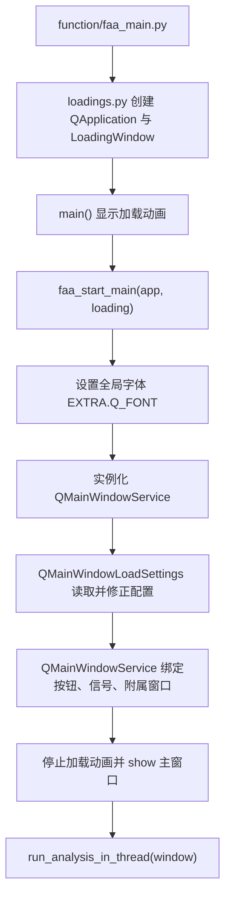

# 系统总览

## 模块职责

本项目是一个基于 PyQt6、OpenCV、Windows 消息投递和 ONNX 推理的《美食大战老鼠》自动化助手。它的核心工作可以概括为四层：

- 启动与全局初始化：创建 `QApplication`、加载资源、建立全局变量和日志/信号对象。
- 主窗口与配置层：加载 UI、把 `settings.json` 映射到界面，再把界面操作转回配置。
- 运行时编排层：根据按钮、定时器或任务序列驱动 `ThreadTodo`。
- FAA 与战斗层：面向游戏窗口做跳转、截图、识图、选卡、放卡、领奖和清理。

## 关键文件/类

- `function/faa_main.py`
  图形化主入口。
- `function/globals/loadings.py`
  在模块导入阶段创建全局 `QApplication` 和加载窗口。
- `function/core/loading_window.py`
  启动画面与进度动画。
- `function/core/qmw_0_load_ui_file.py`
  主窗口 UI 装载基类。
- `function/core/qmw_3_service.py`
  主窗口顶层服务类与 `faa_start_main()`。
- `function/globals/EXTRA.py`
  全局运行参数与共享状态。
- `function/globals/get_paths.py`
  全局路径构建与目录检查。
- `function/globals/g_resources.py`
  资源预加载。

## 目录分层

- `function/common/`
  窗口截图、模板匹配、键鼠封装、进程与启动管理等基础设施。
- `function/core/`
  主窗口、日志、配置、服务层、`FAA` 相关模块、编辑器与其他核心逻辑。
- `function/core_battle/`
  战斗执行器与放卡线程。
- `function/globals/`
  全局路径、资源、信号、动作队列、字体和共享参数。
- `function/scattered/`
  杂项但重要的业务工具，包括方案校验、关卡信息、分任务、OCR 文本辅助等。
- `function/extension/`
  脚本扩展系统及其独立 UI。
- `function/yolo/`
  ONNX 模型推理。

## 启动链路

## 主流程说明

- `faa_main.py` 本身很薄，只负责锁定主进程、显示加载窗口并把控制权交给 `faa_start_main()`。
- `loadings.py` 在导入时就创建了全局 `app` 和 `loading`，因此后续很多模块能直接引用它们。
- `EXTRA.py` 也会在导入期执行部分初始化：
  - 加载字体。
  - 生成合法关卡 ID 列表。
  - 运行 `ethical_core()`。
- `get_paths.py` 在导入时会检查并补齐日志、资源和结果目录，所以路径初始化不是懒加载，而是启动期即执行。
- `g_resources.py` 会把 `resource/image`、`config/cus_images` 和部分日志图像预读入内存，降低运行期频繁磁盘读取。

## 关键设计点

- 很多“初始化”发生在模块导入期，而不是显式的启动函数里。
- 全局对象很多，`EXTRA`、`SIGNAL`、`T_ACTION_QUEUE_TIMER`、`g_resources` 都属于“全局单例式”依赖。
- 项目强依赖 Windows：
  - `win32gui`、`win32con`、`windll.user32`
  - 通过窗口消息投递点击和键盘事件
  - 通过客户区截图做识图

## 扩展点

- 新增启动参数：在 `faa_start_main()` 附近补充处理即可。
- 新增全局目录或资源缓存：集中放在 `get_paths.py` 和 `g_resources.py`。
- 新增全局运行开关：放入 `EXTRA.py`，但要注意它是导入期生效的。

## 常见坑

- 导入副作用较多，单独运行局部脚本时容易因为全局初始化顺序出问题。
- `QApplication` 不是在 `main()` 内创建，而是已经在 `loadings.py` 中构造。
- `get_paths.py` 和 `g_resources.py` 会直接读写文件系统；如果路径布局和预期不一致，错误会在启动早期出现。
