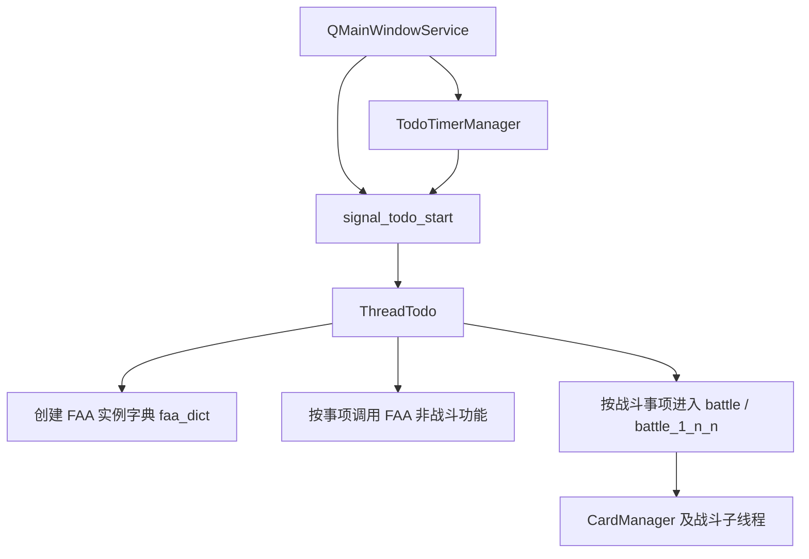

# 运行时编排与 FAA 核心

## 模块职责

这一层解决“用户点了开始之后到底谁去干活”的问题。它主要分为两部分：

- `QMainWindowService`
  负责接收 UI 指令、创建线程、控制定时器和附属能力。
- `ThreadTodo` + `FAA`
  负责把配置转换成具体的游戏操作、战斗任务和事项流水线。

## 关键文件/类

- `function/core/qmw_3_service.py`
  `QMainWindowService` 与 `faa_start_main()`
- `function/core/todo.py`
  `ThreadTodo`
- `function/scattered/todo_timer_manager.py`
  定时执行管理
- `function/core/faa/faa_mix.py`
  `FAA` 聚合入口
- `function/core/faa/faa_core.py`
  FAA 主体能力
- `function/core/faa/faa_action_interface_jump.py`
  地图/界面跳转
- `function/core/faa/faa_action_receive_quest_rewards.py`
  奖励领取相关动作
- `function/core/faa/faa_battle_preparation.py`
  战前准备和战后收尾
- `function/core/faa/faa_battle.py`
  战斗过程动作

## 线程与执行关系

## `QMainWindowService`

### 主要职责

- 保有主线程状态：
  - `thread_todo_1`
  - `thread_todo_2`
  - `todo_timer_manager`
- 管理主按钮：
  - 一键启动
  - 定时启动
  - 保存配置
  - 窗口隐藏/缩放
- 管理附属窗口：
  - 战斗方案编辑器
  - 关卡方案编辑器
  - 配置迁移器
  - 实用工具
  - 多个说明弹窗
- 管理杂项功能：
  - 自启动
  - 米苏物流链接测试与线上关卡信息同步
  - 公会管理器数据刷新
  - QQ 密码登录信息保存

### 启停逻辑

- `todo_start()`
  - 根据当前配置创建 `FAA` 实例
  - 创建并启动 `ThreadTodo`
  - 记录线程状态，锁定相关按钮
- `todo_end()`
  - 从外到内中断线程
  - 清理 `ThreadTodo` 和内部线程
  - 恢复 UI 可操作状态

## `ThreadTodo`

### 主要职责

`ThreadTodo` 是真正的编排器。它把 `settings.json`、任务序列、关卡方案和战斗方案组合起来，执行一整趟事项。

### 任务族

按代码职责可以把 `todo.py` 的方法分成几组：

- 账号与环境维护
  - 启动/关闭 360
  - 刷新游戏
  - 返回登录界面
- 日常事项
  - 签到
  - 浇水/施肥/摘果
  - 删除物品
  - 使用消耗品
  - 暗晶兑换
  - 温馨礼包
- 奖励与任务
  - 领取任务奖励
  - 扫描公会/情侣/悬赏/大赛任务
  - 查漏补缺
- 战斗事项
  - 单关多次
  - 多关多次
  - 工会任务/情侣任务/悬赏/世界 Boss/魔塔/萌宠神殿
  - 全自动大赛
- 自定义事项
  - 任务序列
  - 扩展脚本
  - 天知强卡器联动

### 运行模式

- 常规模式：`thread_todo_1` 负责完整任务序列与大多数事项编排。
- 组队战斗：主线程内部可以驱动 1P/2P 协作完成组队事项。
- 双线程单人作战：`thread_todo_2` 只在特定战斗场景下被主线程信号拉起，负责 2P 的 `battle_1_n_n()` 支线执行。

代码里的副线程不是“任意双号全并行编排器”，而是为若干多线程单人战斗场景准备的辅助线程。

## `FAA` 核心对象

### 对象结构

`FAA` 在 `faa_mix.py` 中通过多继承组合多个能力块：

- `FAABase`
  核心状态、关卡配置、方案解析、日常功能主体。
- `FAAActionInterfaceJump`
  地图与界面跳转。
- `FAAActionReceiveQuestRewards`
  奖励领取相关动作。
- `BattlePreparation`
  选卡、换卡组、进房、结算、翻牌、掉落识别。
- `FAABattle`
  战斗中动作，如放卡、用铲、拾取、波次检测、结束检测。

当前代码中 `FAASynthesis` 仍处于注释状态，没有真正加入 `FAA` 聚合类。

### FAA 的状态边界

`FAA` 不是纯工具类，而是重状态对象。它持有：

- 渠道与玩家信息
- 句柄与窗口状态
- 当前关卡与 `stage_info`
- 当前战斗方案与解析结果
- 战斗中的动态状态，如波次、是否用钥匙、自动拾取、记录器对象

## 典型执行链

- 主窗口读取配置并创建 `FAA`
- `ThreadTodo` 判断当前事项类型
- 如果是非战斗事项，直接调用 `FAA` 的日常方法
- 如果是战斗事项：
  - 设置关卡与方案
  - 进房并换卡组
  - 启动战斗
  - 收尾并记录掉落

## 扩展点

- 新增事项类型：
  - 优先落在 `ThreadTodo`，补充任务参数解析和执行入口
- 新增窗口内按钮行为：
  - 放在 `QMainWindowService`
- 新增游戏动作：
  - 如果是导航行为，放 `faa_action_interface_jump.py`
  - 如果是战前/战后行为，放 `faa_battle_preparation.py`
  - 如果是战斗中动作，放 `faa_battle.py`

## 常见坑

- `ThreadTodo` 文件极大，但它的核心职责始终是“编排”，不要把底层窗口操作继续堆进去。
- `FAA` 是重状态对象，跨方法共享大量字段；改某个流程时要注意它会不会影响后续战斗轮次。
- 双线程模式下大量地方依赖 `EXTRA.FILE_LOCK` 和线程同步；读写方案、日志和结果文件时要格外小心。
