# 战斗引擎主流程

## 模块职责

战斗引擎负责把“关卡 + 方案 + 当前战况”变成具体的游戏内放卡行为。它不是单一文件，而是三层协作：

- FAA 战前准备层：选卡、换卡组、进房、结算、收尾。
- FAA 战斗过程层：波次检测、结束检测、玩家/卡片/宝石/铲子动作。
- `core_battle` 执行层：`CardManager` 与多个子线程，持续把方案转换成动作队列。

## 关键文件/类

- `function/core/faa/faa_battle_preparation.py`
- `function/core/faa/faa_battle.py`
- `function/core/faa/faa_core.py`
- `function/core_battle/card_manager.py`
- `function/core_battle/card_queue.py`
- `function/core_battle/card.py`
- `function/core_battle/special_card_strategy.py`
- `function/scattered/class_battle_plan_v3d0.py`

## 战斗执行链路

```mermaid
flowchart TD
    A["ThreadTodo 发起战斗事项"] --> B["FAA.set_config_for_battle()"]
    B --> C["FAA.set_battle_plan()"]
    C --> D["battle_preparation_change_deck() / 选卡 / 进房"]
    D --> E["start_and_ensure_entry()"]
    E --> F["battle_a_round_init_battle_plan()"]
    F --> G["CardManager 初始化卡片计划与子线程"]
    G --> H["持续检测波次/结束/特殊卡/障碍"]
    H --> I["动作写入 CardQueue 与 T_ACTION_QUEUE_TIMER"]
    I --> J["perform_action_capture_match_for_loots_and_chests()"]
    J --> K["回房或回到对应界面"]
```

## 战前准备

`faa_battle_preparation.py` 负责战斗前后最复杂的 UI 流程。

### 进入战斗前

- 识别并扫描卡片
- 根据关卡和战斗方案生成应带卡列表
- 自动补任务卡、承载卡、额外卡
- 移除 ban 卡
- 切换卡组
- 创建房间并确认进入成功
- 启动前置加速

### 战斗结束后

- 处理潜在黑屏或任务完成弹层
- 截图并识别战利品
- 处理翻宝箱
- 回到房间或特殊场景的上级界面
- 为后续轮次准备状态

## 方案解析

战斗方案并不是“读取 JSON 直接执行”，而是会在运行前经过解析与归一化。

### 关键入口

- `set_battle_plan()`
  绑定当前使用的战斗方案。
- `init_battle_plan_card()`
  把方案转成当前波次的放卡计划。
- `battle_a_round_init_battle_plan()`
  在真正开战前完成本轮战斗的方案初始化。

### 解析时关注的内容

- 卡组里的卡和战斗方案引用的卡是否一致
- 任务卡与承载卡是否需要自动注入
- 关卡障碍是否要剔除某些位置
- 极寒冰沙、坤卡、武器技能等额外机制是否要加入计划
- 波次事件和定时事件如何映射到运行时结构

## `CardManager`

### 主职责

`CardManager` 是战斗执行器，负责在战斗中不断观察战况并生成动作。

### 主要工作

- 从 FAA 已解析的方案中初始化卡片列表与卡队列
- 为每个玩家建立独立 `CardQueue`
- 创建多个子线程：
  - `ThreadCheckTimer`
  - `ThreadUseCardTimer`
  - `ThreadInsertUseCardTimer`
  - `ThreadUseSpecialCardTimer`
- 在波次切换时切换当前方案
- 在战斗结束时统一停掉子线程

### 子线程角色

- `ThreadCheckTimer`
  周期性检查是否结束、是否切波、是否可自动拾取、是否该触发武器技能等。
- `ThreadUseCardTimer`
  从卡队列中取出“当前最应该放的卡”并实际执行。
- `ThreadInsertUseCardTimer`
  专门处理定时插卡、铲子、宝石等“插入型动作”。
- `ThreadUseSpecialCardTimer`
  高级战斗能力，处理特殊老鼠、障碍、冰块、神风等对策逻辑。

## 队列与动作

战斗动作不是立即直接点击，而是经过多层转化：

- 战斗方案事件
- `CardManager` 计算出的待执行动作
- `CardQueue` 内部排序与排队
- `T_ACTION_QUEUE_TIMER` 做最终节流并向窗口发送点击/键盘消息

这样做的目的，是把“策略计算”和“底层点击频率”解耦。

## 与掉落/结果系统的衔接

战斗主流程不会在结束画面立刻停止，而是继续完成：

- 掉落识别
- 宝箱识别
- 日志图像保存
- 数据整理
- 回房或下一关准备

所以在维护时要把“战斗结束”和“战斗轮次真正结束”区分开。

## 扩展点

- 新增战斗事件类型：
  - 先扩展 `class_battle_plan_v3d0.py`
  - 再扩展编辑器和 `CardManager`
- 新增高级对策逻辑：
  - 优先落在 `ThreadUseSpecialCardTimer`
- 新增战后处理：
  - 优先放 `faa_battle_preparation.py`

## 常见坑

- `CardManager` 线程较多，结束流程和波次切换容易竞态。
- 战斗方案解析会混入关卡信息、额外卡和自动策略，实际执行内容不一定等于 JSON 原文。
- 战后掉落识别是战斗主流程的一部分，不能简单把“检测到结束”当作整轮结束。
