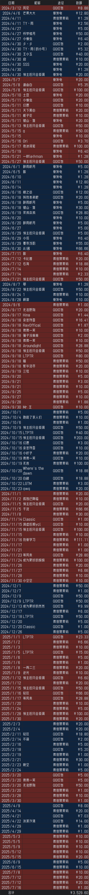

# 前言

本文由项目发起人和主要开发者直视深渊书写;

在此项目的发展过程中，我得到了许多人的帮助和支持;  
我想要特别感谢各位，你们的贡献对我至关重要;  
无论是提供专业知识、资源支持还是鼓励和建议;   
每一份努力都对本项目的发展起到了不可或缺的作用。

# 社区贡献

以下排序不分先后, 感谢你们!

* 八重垣天知(1929238)
  * 第一代战斗方案编辑器的开发者;
  * 深度参与了包括 V3战斗方案 / 公会管理器 在内的本项目的多个重要功能模块的开发;
  * 长期维护并修正了大量bug!
* 执念
  * 超强高级战斗模式 / 皮肤选项 的开发者;
  * 深度参与了FAA的新版UI开发;
  * 长期维护并修正了大量(和偶尔导致)了大量bug! 
* 怜梦惜月
  * 群AI浅羽酱的妈(误);
  * 自动美食大赛功能 - V3 - OCR版 字符串解析 / 图像框选;  
* 夏夜浅酌
  * 本群的提拉米鼠机器人赞助者; 
  * FAA X 米苏物流 前端开发与域名提供; 
* QQ: 考取功名的范进 - Github: SaltedFish
  * FAA 拖拽智能填写窗口信息功能, 主要开发者;
* TY丶雨
  * 第二版全自动大赛截图主要贡献者; 
  * 无情的教学狂魔, 萌新之友;
* LTPTR
  * 发现并提交大量bug, 维护了大量轮替关卡配置和战斗方案; 
  * 无情的教学狂魔, 萌新之友;
* 繁华落尽
  * 为FAA第一版战斗序列大赛提供建议, 提供第一版自动大赛的最佳路径;
* Ray
  * 录入了魔塔蛋糕双人70层及以下的承载卡和障碍物配置;
* And You
    * 您B站的一键三连;
    * 讨论QQ为其他玩家提供的帮助;
    * 对FAA的宣传;
    * 提供的宝贵建议和bug反馈;
    * 提供的图片资源;
    * 它们都是FAA项目进步的宝贵助力!

# 赞助清单

项目目前所有的赞助部分已用于QQ群扩容 / 米苏物流服务器和域名等费用, 感谢大家的鼎力支持!
爱发电由于域名限制, 暂时停止使用, 转而使用微信赞赏码和QQ红包, 非常感谢!

